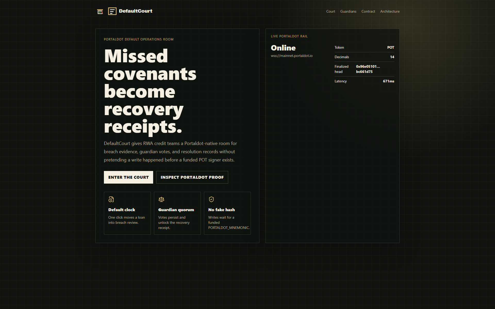
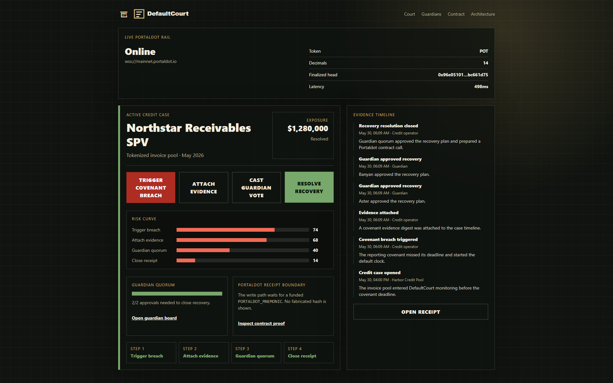
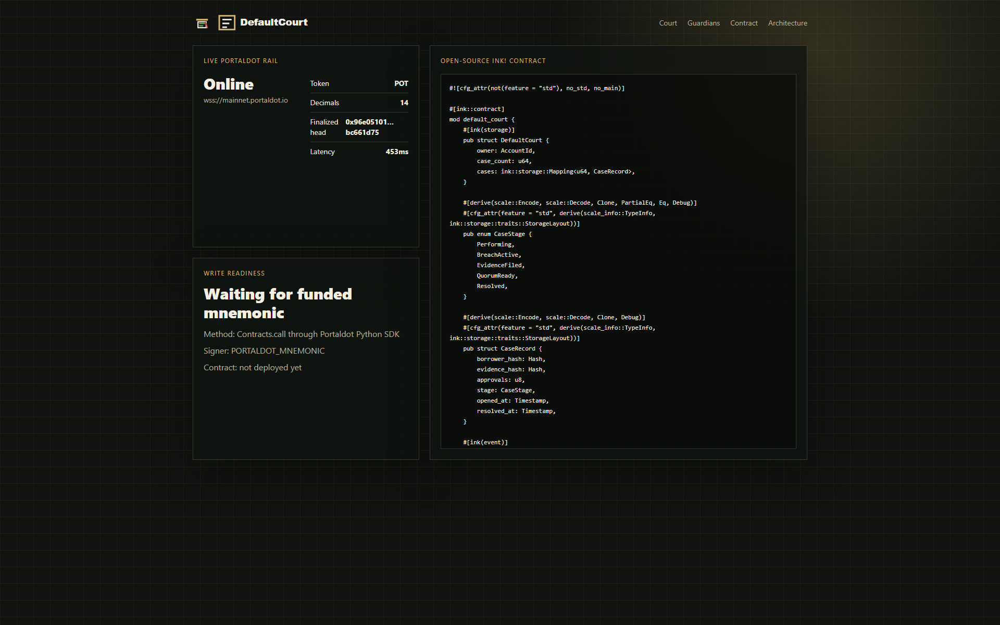

# DefaultCourt

DefaultCourt turns a missed private-credit covenant into a Portaldot recovery room: trigger the breach, attach evidence, collect guardian approvals, close the receipt, and inspect the exact write boundary without inventing a transaction hash.


[Live](https://defaultcourt.veithly.workers.dev) · [Architecture](docs/ARCHITECTURE.md) · [Deployment](docs/DEPLOYMENT.md)



## Why DefaultCourt

RWA credit teams do not need another static wallet dashboard. They need a room for the first hour after a covenant breaks, when the operator has to show evidence, approvals, state history, and the point where a Portaldot write can make the resolution durable.

DefaultCourt is that room. It gives the reviewer a real workflow instead of a token-card mockup: the case survives refresh, guardian votes change the receipt, live Portaldot RPC status is visible, and missing write credentials stay visible as a blocker rather than becoming a fake hash.

## What It Does

- Opens a persisted default case ledger.
- Triggers covenant breach and evidence events.
- Records guardian votes and closes a resolution receipt.
- Reads live Portaldot RPC status from `wss://mainnet.portaldot.io`.
- Ships an ink! contract and deployment script for funded Portaldot writes.
- Refuses to display fake transaction hashes when a funded mnemonic is absent.



## Architecture Snapshot

DefaultCourt runs as a Next.js App Router application on Cloudflare Workers through OpenNext. Production case state is stored in the `DEFAULTCOURT_CASES` Cloudflare KV binding; local development falls back to `.defaultcourt-data/cases.json` so tests stay reproducible.

The Portaldot read path calls WebSocket JSON-RPC for finalized-head and chain property data. The write path is intentionally separate: real contract deployment or calls require a funded `PORTALDOT_MNEMONIC` and a deployed `PORTALDOT_CONTRACT_ADDRESS`.



## Quick Start

```bash
npm install
npm run dev
```

Open <http://localhost:3000>.

The app defaults to `wss://mainnet.portaldot.io` for read-only Portaldot status. Create `.env.local` only when you need to override the RPC endpoint or run funded contract writes.

## Portaldot Write Path

The read path and local workflow run without private credentials. Real contract deployment or calls require:

```bash
PORTALDOT_MNEMONIC="<funded throwaway mnemonic>"
PORTALDOT_RPC_URL="wss://mainnet.portaldot.io"
```

Then build the ink! contract and run:

```bash
python scripts/portaldot_deploy_contract.py
```

## Architecture

See [docs/ARCHITECTURE.md](docs/ARCHITECTURE.md).

## Deployment

The live Worker is deployed at [defaultcourt.veithly.workers.dev](https://defaultcourt.veithly.workers.dev). Cloudflare deployment details and smoke commands are in [docs/DEPLOYMENT.md](docs/DEPLOYMENT.md).

## License

MIT
